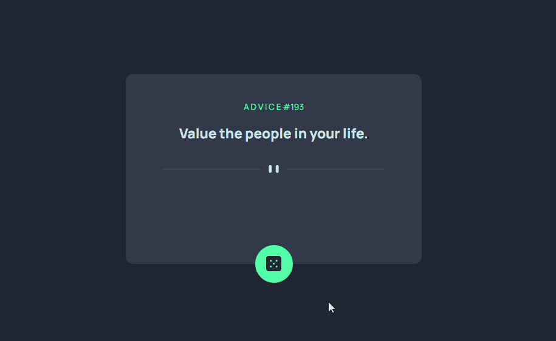

# Gerador de Conselhos

Apenas uma prática feita durante os estudos que ajuda a pegar o costume do uso no GitHub.

### Desafio

Criar um Gerador de Conselhos dinâmico usando o que aprendeu.

- Ao clicar no botão o usuário requisita um ID de conselho na API do AdviceSlip que é entregue no centro da tela.

## Tecnologias utilizadas

- HTML
- CSS
- JS
- API

## Autor

Vitor da Rosa - [Github](https://github.com/vtuRose)
